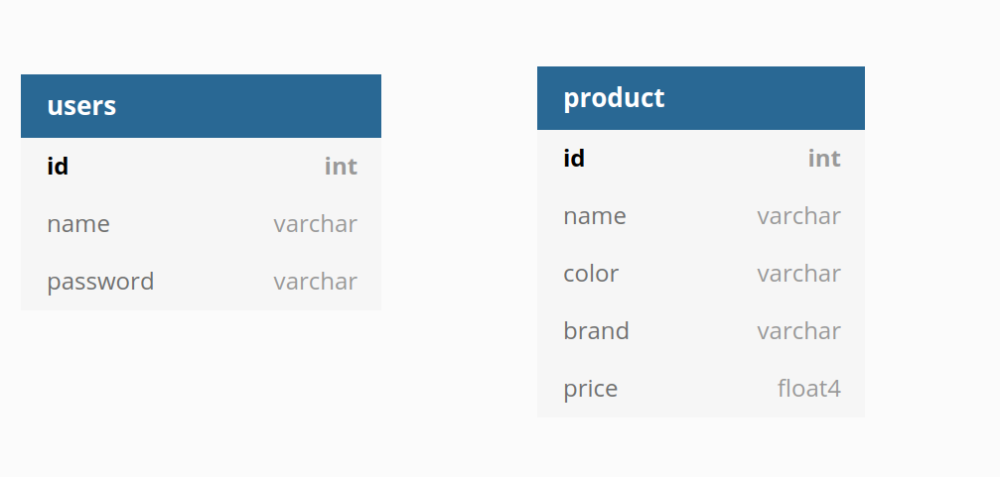

# Backend

Tech Used

1. Node js 
2. express js - http server
3. mysql 

Prerequisite -  NodeJS and NPM is already installed and MYSQL is also already installed in your computer

## Installation

Clone the repository and run the following commads

1. Create the database - run this file  `bash create_db_env.sh`, 

    It prompts for your root username and passoword for your mysql DB 

    It also creates `.env` file, environmental variable 

2. Now run `npm i` to install all the dependencies
3. after installing, run the server
4. Create one user

```jsx
curl --request POST 'http://localhost:3000/customers' \
--header 'Content-Type: application/json' \
--data-raw '{
    "name" : "admin",
    "password":"password",
    "active":true
}'
```

5. Dump the products

```jsx
curl --request POST 'http://localhost:3000/seed' 
```

6. CRUD operations

Get products list

```jsx
curl  --request GET 'http://localhost:3000/product'
```

Get specific product

```jsx
curl  --request GET 'http://localhost:3000/product/2'
```

Create new

```jsx
curl --location --request POST 'http://localhost:3000/product' \
--header 'Content-Type: application/json' \
--data-raw '{
        "name": "Candida Bakanauskas",
        "brand": "Edwin",
        "color": "Riendeau",
        "price": 2808
    }'
```

Delete All Product

```jsx
curl --location --request DELETE 'http://localhost:3000/product'
```

Delete specific product

```jsx
curl --location --request DELETE 'http://localhost:3000/product/1'
```

## DB Schema

